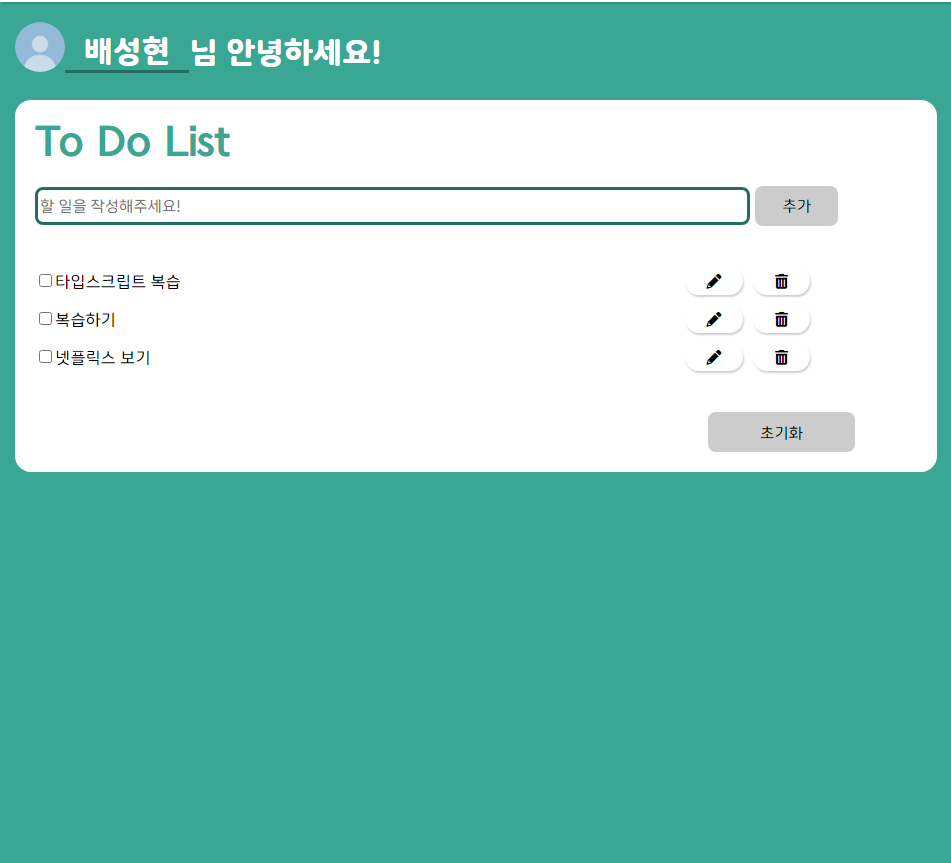
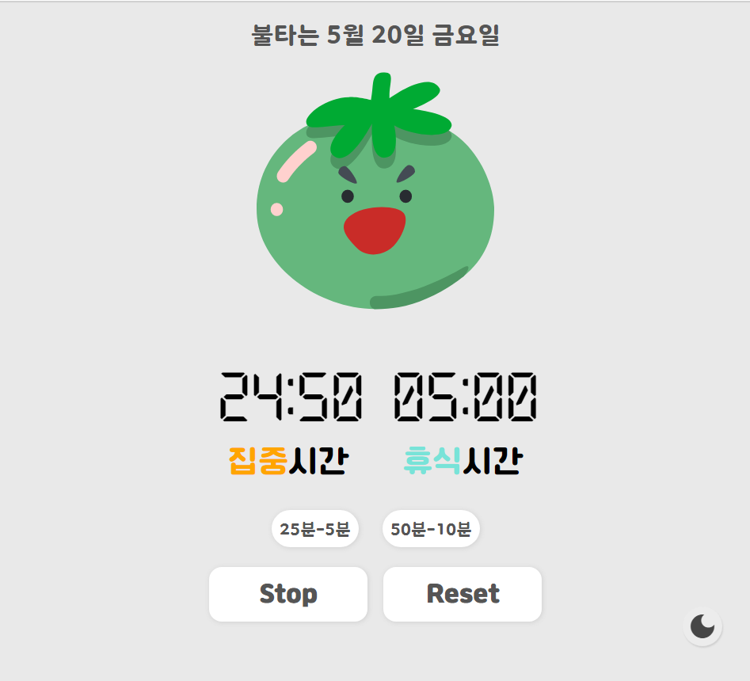
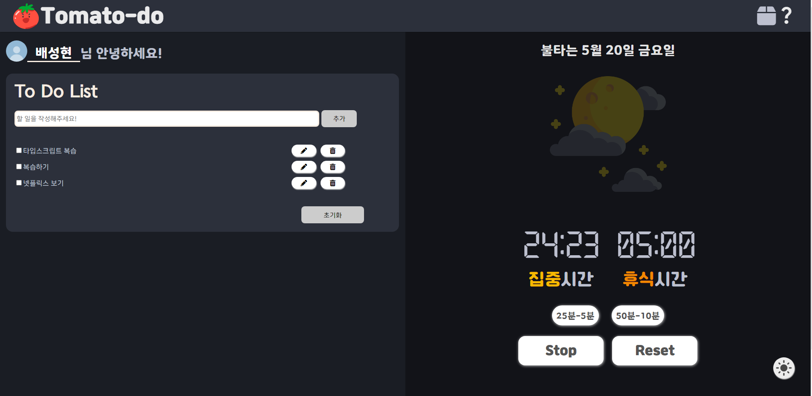

# Tomato-do (뽀모도로 타이머 + 투두리스트)

## Description
> 2022.04. - 2022.05.

### Summary

* 투두리스트, 타이머, 프로필, 뱃지, 테마 기능
* IndexedDB 사용으로 인한 브라우저(기기) 변경 시 데이터 이동 불가능

## About Project

### FE

    

* 투두리스트 : DB와 통신하여 CRUD 기능 수행
* 타이머 : 집중-휴식 타이머 기능, 타이머 사용 시 시간 정보 DB에 저장
* 프로필 : 이름, 사진
* 뱃지 : DB에 쌓인 시간 데이터에 따른 뱃지 제공
* 테마 : 데이-나이트 모드

### BE

 

* IndexedDB 사용
* IndexedDB 구조
	```js
	todolist:  "++id,todo,check",
	time:  "++id",
	userInfo:  "++id,userName,userimg,type",
	report:"++id,date,startTime,endTime"
	```


## Results
### Web

|기능|화면|
|:---:|:---:|
|투두리스트||
|타이머||
|테마||

## Developers
||||||
|:---:|:---:|:---:|:---:|:---:|:---:|
|[서정민](https://github.com/HAPPY-JM)|[김동철](https://github.com/GreyFBTT)|[박태훈](https://github.com/ekdh0858)|[배성현](https://github.com/seonghbae)|[지재영](https://github.com/jaeyeong815)|[이수정](https://github.com/tinashome)|
